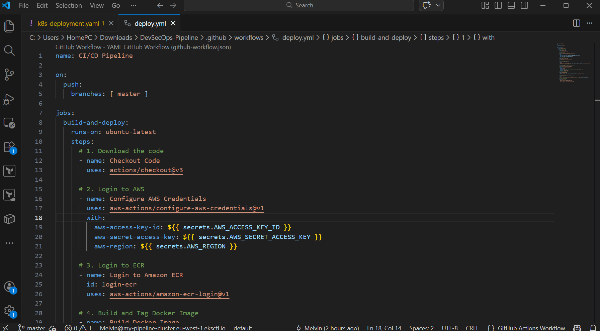
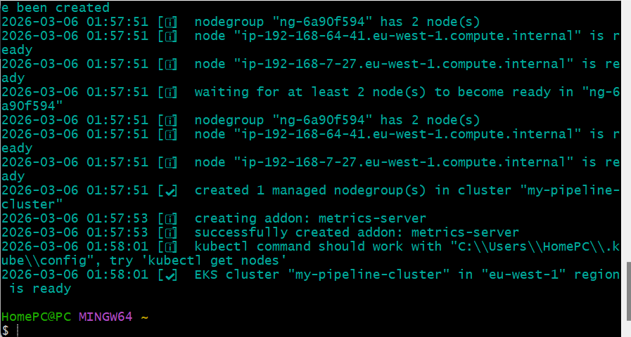
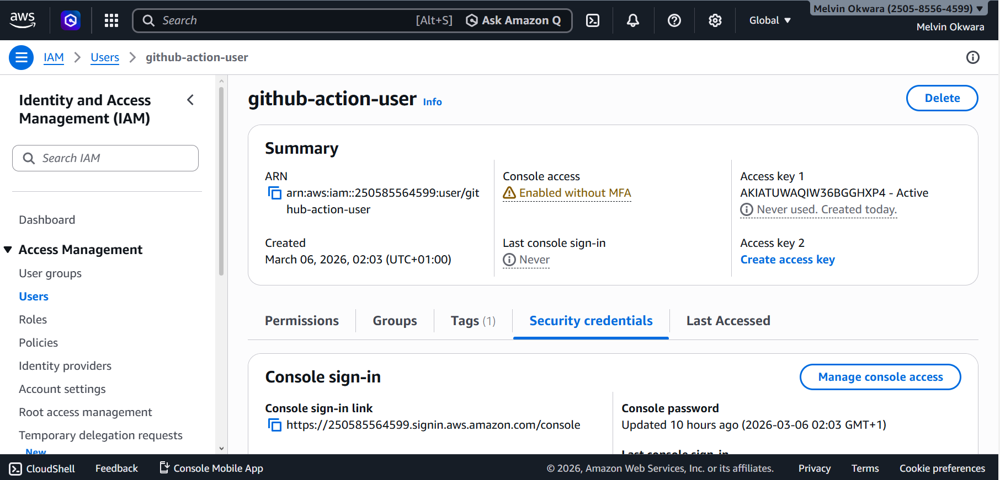
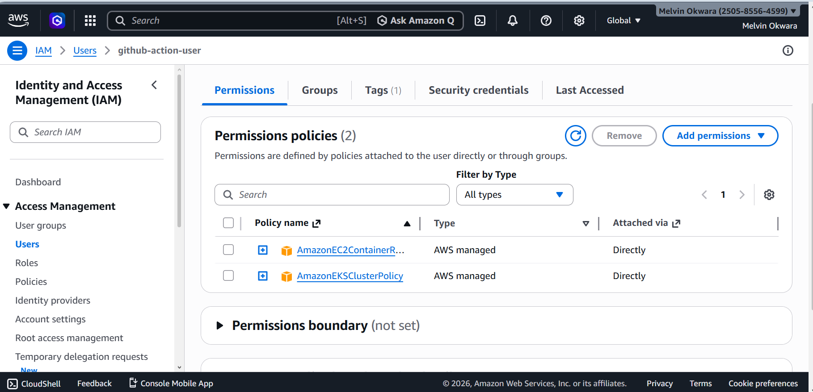
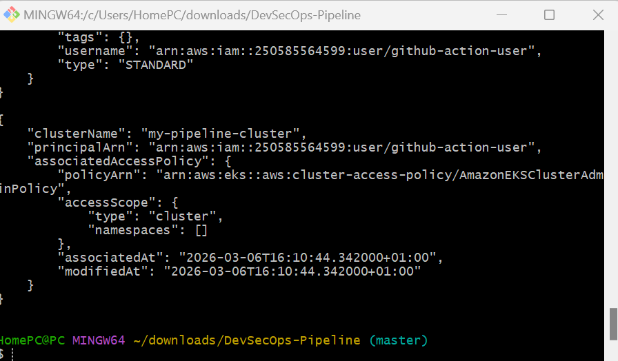
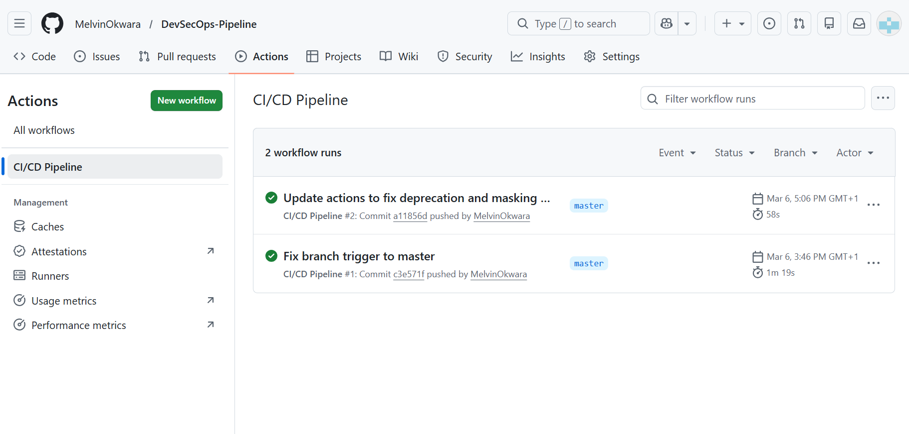
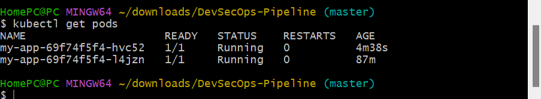

# 🚀 Enterprise DevSecOps Pipeline on AWS EKS

## 📖 Project Overview
This project implements a fully automated **CI/CD Pipeline** with integrated security scanning. It transitions a containerized web application from a local development environment to a production-ready **Amazon EKS** cluster.

### 🌟 Key Features
- **Automated CI/CD:** Powered by GitHub Actions for zero-touch deployment.
- **Security-First (DevSecOps):** Integrated **Trivy** vulnerability scanning.
- **Scalable Hosting:** Deployed on **Amazon EKS** with load-balanced replicas.
- **Identity & Access:** Secured via **AWS IAM** and Kubernetes Access Entries.

---

## 🛠 Tech Stack
- **Cloud:** AWS (EKS, ECR, IAM, VPC)
- **CI/CD:** GitHub Actions
- **Containers:** Docker
- **Security:** Aqua Security Trivy
- **Orchestration:** Kubernetes (kubectl, eksctl)

---

## 📸 Technical Walkthrough

### 1. The Pipeline Logic
The core of the project is the `.github/workflows/deploy.yml` file, which defines the build-scan-deploy logic.

### 2. Cloud Infrastructure
The infrastructure was provisioned using `eksctl`, setting up a multi-node cluster in the `eu-west-1` region.

### 3. Security & IAM
Following the **Principle of Least Privilege**, a dedicated IAM user was configured with specific permissions for ECR and EKS.

### 4. Kubernetes Authorization
To allow the external GitHub Runner to deploy code, I configured **EKS Access Entries** to map the IAM user to the cluster's administrative role.

### 5. Deployment Success
The final pipeline run shows a successful build, security scan, and push to production.

### 6. Production Environment
Verification of the live environment showing pods running successfully across the cluster.

---

## 👤 Author
**Melvin Okwara**
*DevOps & Cloud Engineer*
